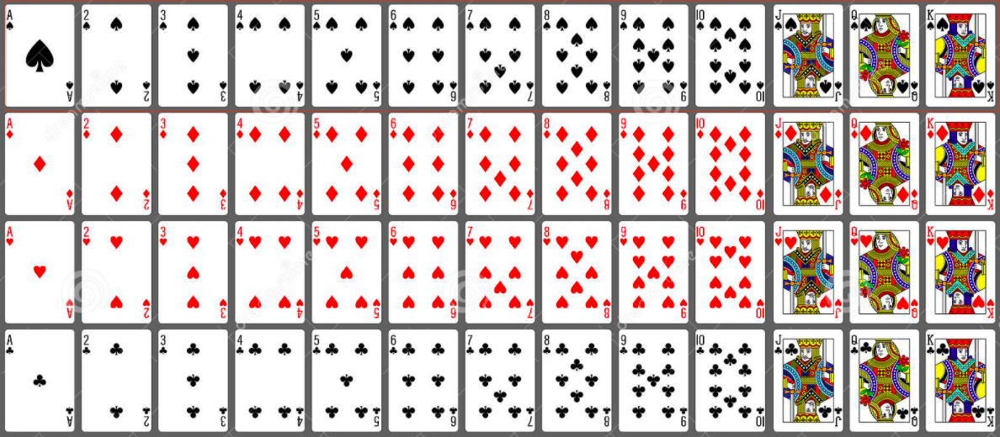
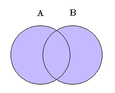
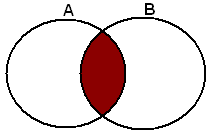

<!-- 
What is the purpose of the data structure?

What is the performance of the data structure (you will need to talk about big O notation)?

What kind of problems can be solved using the data structure?

How would the data structure be used in Python (in some cases you will need to discuss recursion)?

What kind of errors are common when using the data structure? -->

# Set

### What is Set
A set is an unordered collection of simple objects in Python. 
In addition to being iterable and mutable, a set has no duplicate elements.
 Any set defined in Python is an instance of the set class.

Compared to a list, a set is advantageous by virtue of having a highly optimized method for
 checking whether some element is contained in the set or not. The general syntax of a set is:

* Sets are unordered
* No duplicate objects, meaning it only contains unique objects
#
### How does it work
1. Create a set
```python
  
# create a set
myset = set(["a", "b", "c"])
print(myset)
```

Output:
```
{'c', 'b', 'a'}
```
#
2. Add

Use add function to add an element to a set
```python
# Adding element to the set
myset.add("d")
print(myset)
```
Output:
```
{'d', 'c', 'b', 'a'}
```
#
3. Union 
Two sets can be merged using union() function or | operator. 
Both Hash Table values are accessed and traversed with merge operation perform on them to combine the elements, 
at the same time duplicates are removed. Time Complexity of this is O(len(s1) + len(s2)) where s1 and s2 are two sets whose union needs to be done.



```python
A={1,2,3,4,5}
B={4,5,6,7,8}

# Three ways to union A and B

print(A|B)
set([1, 2, 3, 4, 5, 6, 7, 8])

A.union(B)
set([1, 2, 3, 4, 5, 6, 7, 8])

B.union(A)
set([1, 2, 3, 4, 5, 6, 7, 8])

```
#
4. Intersection
This can be done through intersection() or & operator. Common Elements are selected.

```python
A={1,2,3,4,5}
B={4,5,6,7,8}

# Three ways to union A and B

print(A&B)
set([4, 5])

 A.intersection(B)
set([4, 5])

B.intersection(A)
set([4, 5])
```
#
5. Difference
Difference of A and B (A — B) is a set of elements that are only in A but not in B. Similarly,
 B — A is a set of element in B but not in A.
Difference is performed using — operator. 
Same can be accomplished using the method difference().
```python
A={1,2,3,4,5}
B={4,5,6,7,8}

 print(A-B)
set([1, 2, 3])

 print(B-A)
set([8, 6, 7])

A.difference(B)
set([1, 2, 3])

B.difference(A)
set([8, 6, 7])
```

#
### Performance
#
### Examples
#
### Challenge
Download [Set Challenge](set_challenage.py)
#
### Answer
Download [Set Answer](set_answer.py)
